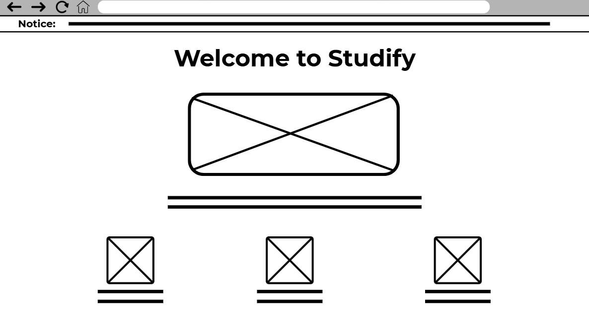

## **Studify \- Portfolio for 10CT Task 2 (Ray Wong)**  
### **Mind map (Divergent Thinking)**

| Idea name | What it does | Influence it explores | Who it helps |
| :---- | :---- | :---- | :---- |
| School Music App | It allows the user to select a playlist of music for a specific subject, particularly in school (e.g. concentrative music for maths) | It explores the realm of school and how it may create stress for students | Those who feel stressed from school, or just need something to listen to while studying, are the target audience for this app. |
| Everything store | A bit like amazon, but products from external stores (e.g. Woolworths) are compiled and displayed on the site, giving a very wide range of products to shop for. When a user wants to look further into the product, they will be directed onto the external shop’s site. | It explores the influence of commerce, especially for consumers who need to make a choice when shopping. | This app makes it more convenient for customers who want to explore a wide range of options when shopping, while buying it from trusted stores |
| Digital wardrobe  | This app allows for users to customize their fashion online by letting them select clothing, accessories and cosmetics and what store/s they can buy it from. | It explores the influence of commerce, especially for consumers who need to make a choice when shopping.  | This app is helpful for customers who want to simulate trying different fashion items from the convenience of their computer, making mixing and matching much easier |
| Digital cookbook | This is a website that allows users to make or select a recipe, and then view the real time price of the ingredients and where they can buy them from | It explores the influence of commerce, especially for those who need something convenient to make a choice when shopping for groceries and such. | This website is useful for those who may be interested in cooking, or just need a convenient way to make a shopping list for a recipe |
| Flight checker | This website helps users find flights of varying prices, times, airline and destinations according to their needs. | It explores the influence of travelling, especially for those who need to plan their flights quickly and effectively | This website is useful for those who may be inexperienced in travelling or fly frequently.  |
| Trip Planner | This website helps users to plan vacations and trips through browsing optimized hotels, flights and travel routes to create the best travel plan possible.  | It explores the influence of travelling, especially for those who want assistance to plan their travel in the most optimized way | This website is useful for those who may be inexperienced in travelling or travel frequently.  |

### **Convergent Thinking**  
### Impact/Effort Matrix  

### SWOT Analysis  

 
### Evaluation of Feedback  
Based on the feedback given, I have decided to go with my second idea, the School Music App. The main reasons include the fact that getting access to a Google Flights API is very challenging, and it may require payment or limited access which restricts the potential of the flight checker web app. In addition, the app’s functionality might be a bit too ambitious to achieve in the given time, and while it has the potential to create a huge impact, there’s no easy way to gain the information for checking flights freely. The school music app, on the other hand, does not require a huge amount of effort to create, and the impact that it can make on users increases their convenience and time management (based on the feedback). The only problem is having an extensive audio library which requires licensing.

### **Requirements**  
### Functional Requirements  
There are various functional requirements that are required to build the application for its intended purpose; a school music app. Firstly, and most importantly, the app must let the user select the school subject they are studying through a clear interface and then select the corresponding type of music that is best suited for that subject. The specific music must also be scientifically proven to be the most effective for that particular subject, in order to make the studying experience with the app as best as possible for the user. The web app’s music interface should include the following functions: play, pause, volume adjustment, and the music must be playing in the background for extended periods of time. Offline access should also be made available through a download option, in case the user has unreliable network access.  
### Non-Functional Requirements  
To ensure the app is high-quality and reliable, it should meet several non-functional requirements. The app's performance should be fast, with quick load times and smooth, uninterrupted music streaming to ensure the user can reliably use this web app. Its reliability is crucial, requiring a very high uptime and the ability to gracefully handle network disconnections. In addition, security is an important requirement, with user data minimilised or protected through encryption. Finally, the app must have excellent usability, featuring an intuitive, responsive design that is easy for users of all ages to navigate for the best possible experience.

### **Researching and Planning**  
### Exploring Existing Ideas  
### Youtube

| Plus | Minus | Implications |
| :---- | :---- | :---- |
| Allows users to connect with each through video form, allowing them to communicate emotion, actions and opinions Hosts creators through ‘Channels’ where they can upload content to spread trends and opinions Creators can also share knowledge and even free education to viewers Has a way of fostering a community within the app, through comment sections, livestreams and community posts  | While Youtube is a tool that is used to educate and entertain people, it can also be an addictive, time-wasting app  Not all education is truthful, and creators have the freedom to spread misinformation or propaganda Due to the nature of monetisation, authenticity of content can be compromised Fasted paced content can affect attention spans overtime | Youtube is a overall a very useful and influential platform, and hosts a plethora of education, entertainment and personal voices from creators and consumers, although a small part of the platform is affected by inauthenticity, repetitive content and attention-wearing styles of video. Since Youtube likes to adhere to the user’s needs through recommendation algorithms, I will consider adding a similar but simpler function to my web app. |

### Instagram

| Plus | Minus | Implications |
| :---- | :---- | :---- |
| Instagram allows users to connect through not just video, but though posts, photos, and even stories Hosts a more free and open method to share one’s stories through multiple forms of media Influences the movement of e-commerce through online store links, affiliate marketing and product discovery | While Instagram hosts many forms of content, it can become a seed for comparison culture, where reels, stories and photos can set unrealistic expectations especially for the youth Repetitive content are frequently posted for visibility purposes Due to the lack of moderation, comment sections and other forms of connection may display harmful content Just like other social media platforms, misinformation is easily spread through virality | Instagram is an effective platform that cultures personality, identity and culture, and fosters that influence through a variety of media, although containing some negative influence that affects the youth. Since Instagram hosts bite-sized stories, I am considering adding a way to preview music that the user may want to listen to in my app, so that they can save time and decide quickly. |

### ChatGPT

| Plus | Minus | Implications |
| :---- | :---- | :---- |
| ChatGPT is an AI tool that enhances a user’s productivity through prompt-based instant writing, programming and research The AI makes digital “tutoring” a lot more accessible and allows users to explore different learning areas  ChatGPT also helps users unlock new ideas in various creative tasks like projects | While its prompt-based generation is useful, it can decrease a user’s critical thinking and originality is several aspects Frequent users may find that they are overreliant on ChatGPT as a tool While it can generate creative ideas, some of those ideas may become consistent results across multiple uses of the app, leading to repetitive ideas | While ChatGPT remains as an extremely useful tool that boosts productivity, generating creative ideas, and offering more accessible information and learning, frequent users may become overreliant on it which affects critical and creative thinking Since ChatGPT is based on user prompts, I will consider adding an automatic prompt-based search for my music app, where the corresponding prompt will lead to a specific subject’s music |

### **Secondary Research**  
After researching whether music was an effective tool to use while studying, I found that specific different types of music can affect concentration. Overall, music was found to offer a plethora of benefits, which include improved mood, increased motivation, boosted concentration, improved memory, and varying levels of reduction of fatigue and pain.  According to a 2007 study that was featured on [https://www.healthline.com/health/does-music-help-you-study](https://www.healthline.com/health/does-music-help-you-study), the genre of *Classical Music* can help the brain gather new information more efficiently and effectively. In addition, the researchers had found that music was able to engage the brain in a way that it was more effective in paying attention to events. Another study from 2019 suggested that music was capable of triggering reward responses in the brain, just like other enjoyable tasks. This resulted in a much better motivator to complete study-related tasks, and music was a great reward to those who completed tasks or those who were completing the tasks at the same time. However, it was found that music also had a distraction factor where it could drag one’s attention away from their work. But, the distraction usually only came from specific genres of music, especially those that were too loud, fast, experimental or some lyrical music, and specific study tasks, like solving complicated math problems.  
According to another blog “[https://lighthouse.mq.edu.au/article/please-explain/february-2022/please-explain-does-music-help-you-study](https://lighthouse.mq.edu.au/article/please-explain/february-2022/please-explain-does-music-help-you-study) “ from a researcher at Macquarie University, explained how music was capable of calming students who find study material difficult or stressful, as well as making tedious tasks a lot more bearable to work through, therefore making music an effective motivator. Contrary to the previous 2007 study however, findings from Dr Olsen state that while listening to classical music improves concentration and intelligence is a popular belief, there is very little evidence that supports this theory. A further study said that listening to classical music puts the brain into a sophisticated operating mode, but this change in mood works with any other type of music. Dr Olsen also made suggestions on the best types of music for each individual, and he advises that music with no lyrics and minimal abrupt moments are best suited, and should be played in the background with low volume. It should also be considered that some tasks are best suited for specific types of music.  
After researching these findings about music’s effect on studying, there will be a reconsideration on the project’s core concept. The studies found have shown that the best kind of music for studying depends a lot on the individual and is based on how they tolerate music. Since the project’s core concept is based around the best type of music for each subject/task, the person’s personal preferences will be considered, and the “best” type of music for each subject/task will only be a suggestion to the user, and the user will be able to follow that corresponding suggestion or they can listen to what suits them best. This will ensure that the user does not feel limited to the already suggested types of music, and they can adhere to their own preferences, or they can agree upon the suggestions if they wish.

### **Primary Research**  
Based on the survey that was put out with the following questions:

- Do you ever listen to music while studying or completing school-related tasks?  
- When you want to find music to listen to (on platforms like Spotify, Youtube, etc.), how long do you take to find it?  
- Do you find it hard to find music you want to listen to in the background?  
- On a scale of 1-10, does music make you distracted or more concentrated when studying or completing tasks?  
- Do you prefer to have specific genres of music to listen to or are able to listen to just anything when studying or completing tasks?  
- What genre of music do you like to listen to when studying or completing tasks?

A few evaluations can be made. For one, there was a huge variety in the genre of music that people liked to listen to (81% of people preferred to have specific genres), proving that from one of the previous studies from Secondary Research, people have many preferences of music that suits them best. This also challenges Dr Olsen’s advice for which non-lyrical and exciting music isn’t an effective form of background music to study to, and there were many people in the survey who chose genres of music like Hip-Hop, Pop, Rock and Rap. The results also show that most people take under 2 minutes to fid music, which implies that people usually know what music they think is the best for them. In addition, most people say that music has fair boosts of concentration in studying and completing tasks, but not by a huge margin. A small minority also said that they feel more distracted with music playing, implying that the issue with distracting music does exist. Lastly, a minority of people said that the specific genre, K-Pop Demon Hunters, was one of their favourite genres to listen to, which could imply trending music has an impact on what people listen to.   
Based on these findings, there will be a few considerations that will be made for the project moving forward. Firstly, due to the huge variety of genre interest and preferences, I will be proceeding with my suggestions based music types, where, as mentioned before, the genres of music for each subject or task will only be a suggestion to the user, but the user will be able to pick any music genre they wish to study or complete tasks to. Secondly, I will also consider adding a trending music genre, where trending pieces of music will be readily available to listen to. These tracks will be specially organised into their suggested subjects/tasks based on scientific research (for example, lyrical music might be organised into mindless tasks categories). Lastly, as the majority of respondents said they took under 2 minutes to find their music, I will ensure that the user interface of the app will be kept as simple as possible, in order for the user to not spend a lot of time finding their music, and any unnecessary pages of the website won’t be added.  
### **UI/UX Design**  
Below, is the diagram for the website storyboard featuring all the planned pages that will be implemented. It will start with a home page, then the user will either be able to donate to the website or follow through to the subject selection page. Once they are on the subject selection page, they can select through 4 main options, which when one of them is clicked on, will show the page where the music will be able to be played on. The trending music page can also be accessed from the home page in case the user wants to quickly access trending music.  
### Website Storyboard  
 
### Wireframes  
### Home Page:  
 
### Subject selection page:  
 
### Music player page:  
 

### **Prototype using Figma:**  
### Home Page Link \+ Image:  
[https://www.figma.com/proto/BIbiEJfycjATndGgjLiLlt/Untitled?node-id=0-1\&t=0HfW5KAhHkjXaHre-1](https://www.figma.com/proto/BIbiEJfycjATndGgjLiLlt/Untitled?node-id=0-1&t=0HfW5KAhHkjXaHre-1)  
 
### Music Player page \+ Image:  
[https://www.figma.com/proto/BIbiEJfycjATndGgjLiLlt/Untitled?node-id=49-2\&t=0HfW5KAhHkjXaHre-1](https://www.figma.com/proto/BIbiEJfycjATndGgjLiLlt/Untitled?node-id=49-2&t=0HfW5KAhHkjXaHre-1)  
 
*Unfortunately, due to time constraints, the prototype is non-functional with only the design features included.*

### **Producing and Implementing**  
### Development  
(relevant files are included within the repository. An additional link to the website’s github page is also included)  
[https://raybirbz.github.io/10CT-Task-2-Ray-Wong/index.html](https://raybirbz.github.io/10CT-Task-2-Ray-Wong/index.html)  
### Development Process  
The development process started with taking a lot of design and functional inspiration from the above UI prototypes. The home page was first created, with a giant button with stylish box elements and shadows to give its glowing effect. The next line of icons, which justify the use of the app, were created using `flex` to align the items: `flex` was also used for a lot of other elements on the website, including the rest of the home page. The *About Us* section was linked to the "why us" section of the home page, and the `href` was defined by the *About Us*'s `div` id, meaning when it was clicked, the website will automatically scroll down to that section.

The footer is just a collection of a few `div` sections sorted by `flex`, and the `div`s contained `ul` elements that acted as links to the corresponding section. All the `li` items have a special `:hover` effect that change the color of the text when hovered. In addition, the *contact* button was also linked to this footer section, just like the *About Us* button. 

The *subject selection* page is fairly simplistic in design, consisting of a `flex` based `div` with smaller `div`s, which contained `a` elements that acted as links to the corresponding subject page. Each select option also has a special `hover` effect when hovered, which changed the `div`'s `border-color` and `box-shadow` effect.

The music players were the integral part of the web application. Here, a custom `body` class was created to fit the planned design, and a custom header with a fitting background image was created, although it was complicated to do the *English* header since subheadings were also required, "and social studies, languages". Several `div` sections with the same class were implemented as the tracks, fitted with a custom `img` as the cover, and some smaller `div` elements to fit the artist name and track name, as well as the genre and length. 

In order to make the tracks actually play, a JavaScript script was required:

    document.addEventListener('DOMContentLoaded', () => { 
        const playPauseBtns = document.querySelectorAll('.play-pause-btn'); 
        let currentAudio = null; 
        let currentBtn = null;

        playPauseBtns.forEach(btn => {
            btn.addEventListener('click', () => {
                const audioSrc = btn.dataset.src;
            
                if (currentBtn === btn) {
                    if (currentAudio.paused) {
                        currentAudio.play();
                        btn.innerHTML = '&#10074;&#10074;';
                        btn.dataset.playing = 'true';
                    } else {
                        currentAudio.pause();
                        btn.innerHTML = '&#9658;';
                        btn.dataset.playing = 'false';
                    }
                } 
                else {
                    if (currentAudio) {
                        currentAudio.pause();
                        currentBtn.innerHTML = '&#9658;';
                        currentBtn.dataset.playing = 'false';
                    }
                
                    currentAudio = new Audio(audioSrc);
                    currentBtn = btn;
                    
                    currentAudio.play();
                    btn.innerHTML = '&#10074;&#10074;';
                    btn.dataset.playing = 'true';

                    currentAudio.addEventListener('ended', () => {
                        btn.innerHTML = '&#9658;';
                        btn.dataset.playing = 'false';
                        currentAudio = null; 
                        currentBtn = null;
                    });
                }
            });
        });
    });

Essentially, the way it worked was first it waited for all the content to load `(document.addEventListener('DOMContentLoaded', () => { ... })`), then declared the current audio and button state as none, to start, using `let currentAudio = null;` and `let currentBtn = null;`. The script then loops through each play/pause button on the page (`playPauseBtns.forEach(btn => { ... })`), adding a click event listener to each one. When a button is clicked, the code checks if it's the same button that's already playing by using `if (currentBtn === btn)`. If it is, it simply toggles the playback state between play and pause without creating a new audio object. If it's a new button, the script first pauses the currently playing song (if one exists) and resets its button icon. It then creates a new `Audio` object for the selected track (`currentAudio = new Audio(audioSrc);`) and begins playback (`currentAudio.play();`), updating the new button's icon and state. Through this system, the music plays nonstop without 2 tracks playing at the same time and changing the button's state (worth to note that the button icons were created with HTML character entities). In addition, the actual files were referenced through `data-src` which communicated back to the JS file.

Finally, a donation page was also created (although not entirely functional). This page utilised a `form` element that allowed the user to only input numbers, with `min` and `max` attributes for the minimum and maximum values. Another `div` containing a few `input` elements were also added, where the user could type in their card details. A `select` element with relevant `option`s was also required for the expiry date.

### **Testing and Evaluating**

### Project Evaluation
#### **Peer Evaluatation (by Darrell Campoy)**
Ray’s project demonstrates a strong design and functional use. The web app has a simplistic and intuitive ui that allows for easy user access across all pages. Small and effective details within the site such as hover effects and track previews enhance the site by adding more interactivity and user engagement. In addition, the graphics within his website are nice and sleek, and backs up the text to potentially avoid confusion (eg, the backgrounds within the subject playlist selection)

Impact on the target market and Influence: This website targets the demographic of people who listen to music whilst studying. It provides songs and music that are “based on the science of human psychology” and has different playlists for different subjects. By this, it can benefit students by minimising their time in picking good music tracks that can help them focus.

Possible improvements: The project relies on the default resolution of a computer, and seems to break in practical functionality on smaller resolutions or mobile devices. In addition, it can use for more features, such as a loop button.

#### **Evaluation of Issues**
Socially, this project does not have an overall negative influence. The app's design features allow the user to quickly navigate to what they need to access, which is the music player, through an easy-to-use UI system. This app also does not feature any social interaction between users, and all users do not need any accounts to access the app, which nullifies any cyberbullying or social danger concerns. Lastly, the app does not attempt to grab people's attention at all times, and allows the user to use the app minimally in the background while they can do other tasks. Since the app's music features are based on scientific evaluations, there is minimal bias in the selection of music, and the app does not force the user to listen to any music they don't want to.

Ethically, this app uses very, very minimal user data, excluding the donation page, which requires sensitive financial information, securely encrypted to protect info from interceptions or data breaches. The app also does not have any login systems, which makes user interaction anonymous and extremely accessible to anyone. Finally, the web app does not discriminate against any groups of people or ideas negatively, and merely only makes recommendations for styles of music for the appropiate subject.

Legally, this app properly credits all of the music that it uses through artist credentialing, making the source of the music openly accessible. In addition, the app does not require any payment-based subscriptions, and is a profit-free app, which makes capitalising on user payment almost impossible. Any takedown requests from artists or organisations that have created the music are properly addressed in an immediate manner. The donation page's generated funds only go towards hosting the website, and is not capitalising on the availability of music. However, it is still worth to mention that specific artist's music should've been credited where possible, and only compilations should be used with further crediting to every artist involved in making the music.

#### **Project Evaluation**

Overall, the project, Studify was a success in meeting its core purpose for the market, and makes a positive impact on the target market. With the help of a web app structured in HTML, CSS and a bit of JS, a solution was delivered that allows users to play scientifically-supported genres of music while studying to specific subjects, which is the core purpose. It utilises a fairly basic UI that was easy to navigate, which meets its requirement to save the user's time as much as possible. Specifically, the UI design of the music player meets the majority of the planned features, with the play/pause button, music being played continuously, although volume adjustment was ommitted due to time constraints and complexity, as well as downloading tracks for offline use, although that feature could spark some legal trouble and consequences for copyright infringement. The trending music page was also ommitted, and although being featured on the storyboard, was deemed unecessary later on during development.

In addition, the app meets its non-functional requirements, with relatively fast load times of content (less than a second), an easy-to-use interface making it as accessible as possible for users all ages and backgrounds, and minimilised data collection. However, playing the actual music notably took around 2 seconds to actually start playing, indicating the large file size of the songs, although this is slightly dependant on the user's internet speed. 

The time in working on the final product was generally well optimised, with the majority of the planned features being implemented. However, some features, like volume adjustment and duration bar for the music player could've been implemented with more time to learn JavaScript, and the researching stage could've been completed earlier, especially regarding the primary research with google forms and collecting user responses (it took some time to get enough information). Overall though, the time management allowed the final product to deliver its core impact of making studying with music easier on the target market.
